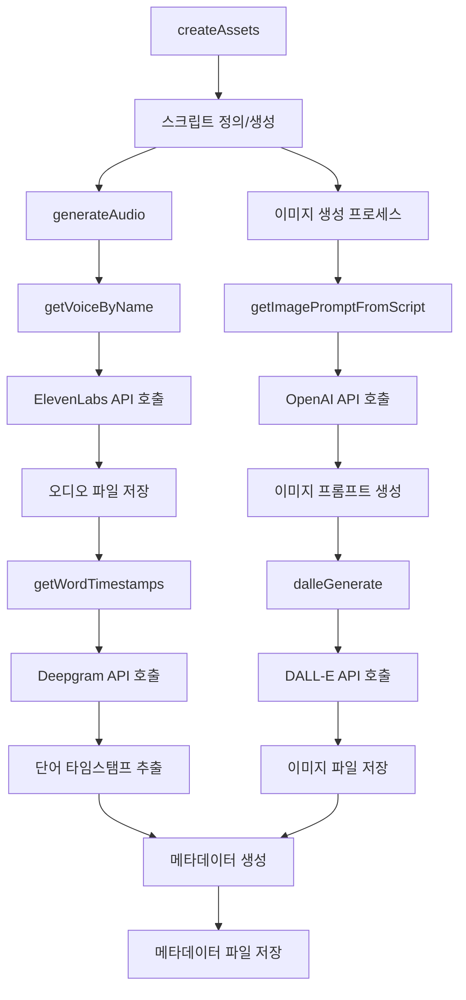
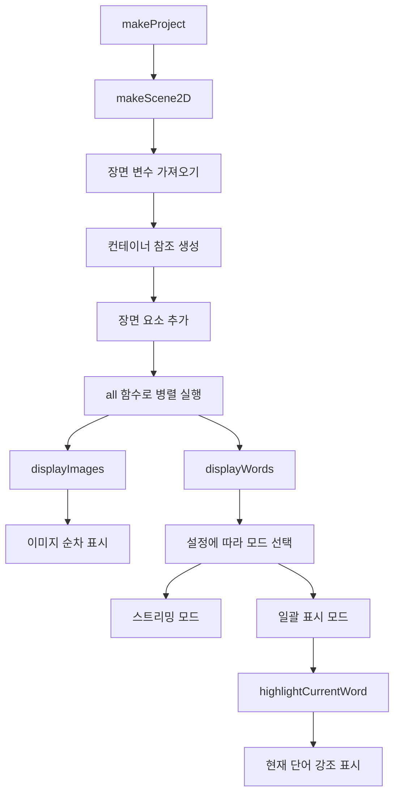
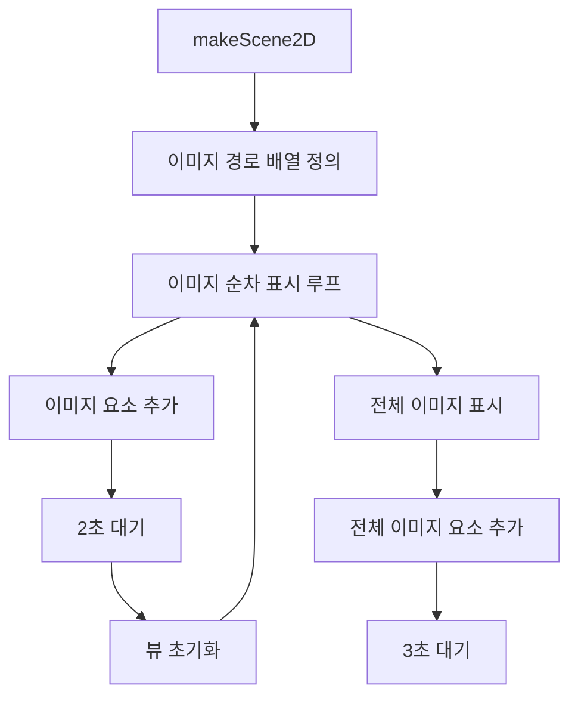
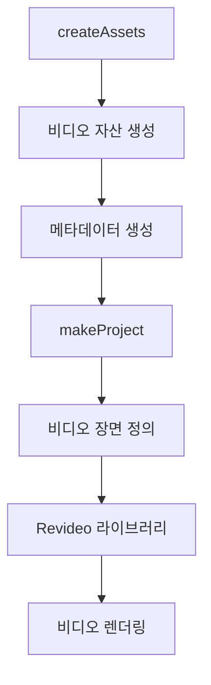

# Revideo 프로젝트 워크플로우

이 문서는 Revideo 프로젝트의 주요 워크플로우와 함수 호출 순서를 설명합니다.

## 목차

1. [비디오 자산 생성 워크플로우](#비디오-자산-생성-워크플로우)
2. [비디오 렌더링 워크플로우](#비디오-렌더링-워크플로우)
3. [만화 장면 워크플로우](#만화-장면-워크플로우)
4. [전체 시스템 워크플로우](#전체-시스템-워크플로우)

## 비디오 자산 생성 워크플로우

비디오 자산 생성 워크플로우는 `src/get-assets.ts` 파일의 `createAssets` 함수를 중심으로 이루어집니다. 이 워크플로우는 비디오 제작에 필요한 모든 자산(스크립트, 오디오, 이미지, 메타데이터)을 생성합니다.

### 호출 순서

1. `createAssets(topic, voiceName)` 함수 호출
   - 고유 작업 ID(`jobId`) 생성
   - 스크립트 정의 또는 생성
   
2. 스크립트 생성 (주석 처리되어 있지만 원래 워크플로우에 포함)
   - `getVideoScript(topic)` 함수 호출
   - OpenAI API를 사용하여 비디오 주제에 맞는 스크립트 생성

3. 오디오 생성
   - `generateAudio(script, voiceName, savePath)` 함수 호출
     - `getVoiceByName(voiceName)` 함수 호출하여 음성 ID 조회
     - ElevenLabs API를 사용하여 텍스트를 오디오로 변환
     - 오디오 파일 저장

4. 단어 타임스탬프 추출
   - `getWordTimestamps(audioFilePath)` 함수 호출
   - Deepgram API를 사용하여 오디오에서 단어 타임스탬프 추출

5. 이미지 생성 (5개 이미지 병렬 생성)
   - 각 이미지에 대해:
     - `getImagePromptFromScript(script)` 함수 호출하여 이미지 프롬프트 생성
     - `dalleGenerate(imagePrompt, savePath)` 함수 호출하여 이미지 생성
     - DALL-E API를 사용하여 이미지 생성 및 저장

6. 메타데이터 생성 및 저장
   - 오디오 URL, 이미지 파일 이름, 단어 타임스탬프를 포함한 메타데이터 생성
   - JSON 형식으로 메타데이터 파일 저장

## 비디오 렌더링 워크플로우

비디오 렌더링 워크플로우는 `src/project.tsx` 파일의 `scene` 함수를 중심으로 이루어집니다. 이 워크플로우는 생성된 자산(오디오, 이미지, 단어 타임스탬프)을 사용하여 비디오를 렌더링합니다.

### 호출 순서

1. `makeProject` 함수 호출
   - 프로젝트 설정 및 장면 정의

2. `makeScene2D('scene', ...)` 함수 호출
   - 장면 변수(이미지, 오디오 URL, 단어) 가져오기
   - 컨테이너 참조 생성

3. 장면 요소 추가
   - 이미지 컨테이너 추가
   - 텍스트 컨테이너 추가
   - 오디오 요소 추가
   - 배경 음악 추가

4. 이미지 및 단어 표시 함수 병렬 실행
   - `displayImages(imageContainer, images, duration)` 함수 호출
     - 이미지를 순차적으로 표시
   - `displayWords(textContainer, words, textSettings)` 함수 호출
     - 단어를 타임스탬프에 맞춰 표시
     - 설정에 따라 스트리밍 모드 또는 일괄 표시 모드 선택
     - 일괄 표시 모드의 경우 `highlightCurrentWord` 함수 호출하여 현재 단어 강조 표시

## 만화 장면 워크플로우

만화 장면 워크플로우는 `src/scenes/utils.tsx` 파일의 `makeScene2D('cartoon', ...)` 함수를 중심으로 이루어집니다. 이 워크플로우는 만화 이미지를 순차적으로 표시합니다.

### 호출 순서

1. `makeScene2D('cartoon', ...)` 함수 호출
   - 이미지 경로 배열 정의

2. 이미지 순차 표시 루프
   - 각 이미지에 대해:
     - 이미지 요소 추가
     - `waitFor(2)` 함수 호출하여 2초 대기
     - 뷰 초기화

3. 전체 이미지 표시
   - 전체 이미지 요소 추가
   - `waitFor(3)` 함수 호출하여 3초 대기

## 전체 시스템 워크플로우

전체 시스템 워크플로우는 비디오 자산 생성과 비디오 렌더링을 연결합니다.

### 호출 순서

1. `createAssets(topic, voiceName)` 함수 호출하여 비디오 자산 생성
   - 스크립트, 오디오, 이미지, 메타데이터 생성

2. 생성된 메타데이터를 `src/metadata.json`에 복사하거나 참조

3. `makeProject` 함수 호출하여 비디오 프로젝트 생성
   - `scene` 함수를 사용하여 비디오 장면 정의
   - 메타데이터를 변수로 사용

4. Revideo 라이브러리를 통해 비디오 렌더링
   - 이미지, 오디오, 텍스트를 동기화하여 비디오 생성

## 주요 함수 간의 관계

이 프로젝트의 주요 함수들은 다음과 같은 관계를 가집니다:

1. **자산 생성 함수**
   - `createAssets` → `getVideoScript` → OpenAI API
   - `createAssets` → `generateAudio` → `getVoiceByName` → ElevenLabs API
   - `createAssets` → `getWordTimestamps` → Deepgram API
   - `createAssets` → `getImagePromptFromScript` → OpenAI API
   - `createAssets` → `dalleGenerate` → DALL-E API

2. **비디오 렌더링 함수**
   - `makeProject` → `makeScene2D` → `displayImages` + `displayWords`
   - `displayWords` → `highlightCurrentWord`

3. **만화 장면 함수**
   - `makeScene2D('cartoon', ...)` → 이미지 순차 표시

이러한 함수 간의 관계를 통해 비디오 생성 및 렌더링 프로세스가 완성됩니다.